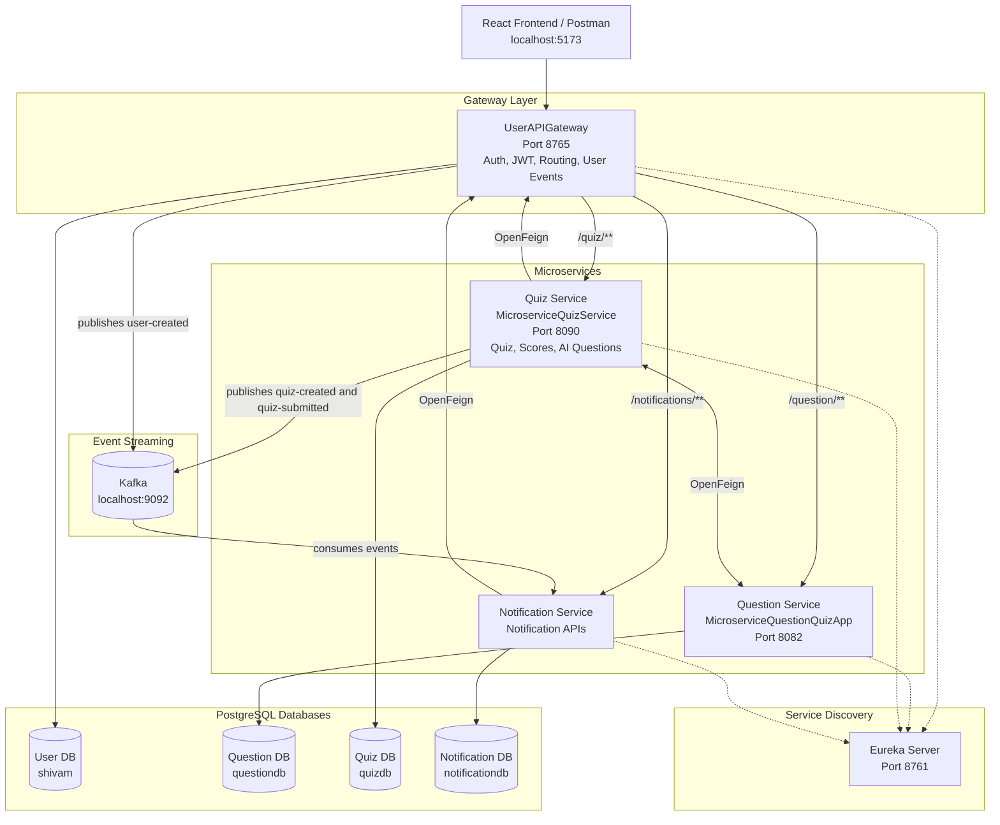

# Quiz Microservices App

A full-stack quiz platform built with Spring Boot microservices, React, PostgreSQL, Eureka Service Registry, Spring Cloud Gateway, OpenFeign, Kafka, JWT authentication, and Spring AI. The application supports user authentication, question management, quiz creation, quiz submission, score history, notifications, role-based access, and AI-assisted question generation.

## Features

- User registration and login with JWT authentication
- Role-based frontend routing and protected pages
- API Gateway for centralized routing and access control
- Eureka-based service registration and discovery
- Question management APIs
- Quiz creation, quiz assignment, quiz submission, and scoring
- Quiz history and score feedback
- AI question generation using Spring AI OpenAI integration
- Kafka event publishing from User API Gateway and Quiz Service for user, quiz-created, and quiz-submitted events
- Notification service for user/admin notification workflows
- React frontend built with TypeScript, Vite, Tailwind CSS, React Query, and Axios
- Safe GitHub configuration using `.gitignore` and `application.example.properties`

## Architecture



## Services

| Service | Directory | Port | Purpose |
| --- | --- | --- | --- |
| Eureka Server | `EurekaServer-Service-Registry` | `8761` | Service registry |
| API Gateway | `UserAPIGateway` | `8765` | Auth, JWT, routing, users, gateway filters, Kafka user-event publishing |
| Question Service | `MicroserviceQuestionQuizApp` | `8082` | Question CRUD and scoring helpers |
| Quiz Service | `MicroserviceQuizService` | `8090` | Quiz generation, submission, history, AI questions, Kafka publishing |
| Notification Service | `NotificationService` | Spring default unless configured | Notification APIs and Kafka consumption |
| Frontend | `frontend` | `5173` | React TypeScript UI |

## Tech Stack

- Java 17
- Spring Boot
- Spring Cloud Gateway
- Spring Cloud Netflix Eureka
- Spring Cloud OpenFeign
- Spring Data JPA
- PostgreSQL
- Apache Kafka
- JWT
- Spring AI OpenAI
- React 18
- TypeScript
- Vite
- Tailwind CSS
- React Query
- Axios
- Vitest

## Project Structure

```text
Quiz_Microservices_App/
├── EurekaServer-Service-Registry/
├── UserAPIGateway/
├── MicroserviceQuestionQuizApp/
├── MicroserviceQuizService/
├── NotificationService/
├── frontend/
├── README.md
└── .gitignore
```

## Prerequisites

- JDK 17
- Maven
- Node.js and npm
- PostgreSQL
- Kafka running on `localhost:9092`

Create the required PostgreSQL databases:

```sql
CREATE DATABASE shivam;
CREATE DATABASE questiondb;
CREATE DATABASE quizdb;
CREATE DATABASE notificationdb;
```

## Configuration

Real `application.properties` files are ignored by Git because they can contain local database credentials, JWT secrets, and API keys.

Each backend service includes a safe template:

```text
src/main/resources/application.example.properties
```

For local development, copy each example file to `application.properties` inside the same service:

```bash
cp src/main/resources/application.example.properties src/main/resources/application.properties
```

Then update placeholders such as:

```properties
spring.datasource.username=YOUR_DB_USERNAME
spring.datasource.password=YOUR_DB_PASSWORD
jwt.secret=YOUR_BASE64_ENCODED_JWT_SECRET
spring.ai.openai.api-key=YOUR_OPENAI_API_KEY
```

Do not commit real secrets or API keys.

## Backend Startup

Start services in this order:

1. Eureka Server
2. User API Gateway
3. Question Service
4. Quiz Service
5. Notification Service

Run each service from its own directory:

```bash
cd EurekaServer-Service-Registry
mvn spring-boot:run
```

```bash
cd UserAPIGateway
mvn spring-boot:run
```

```bash
cd MicroserviceQuestionQuizApp
mvn spring-boot:run
```

```bash
cd MicroserviceQuizService
mvn spring-boot:run
```

```bash
cd NotificationService
mvn spring-boot:run
```

Eureka dashboard:

```text
http://localhost:8761
```

API Gateway:

```text
http://localhost:8765
```

## Frontend Setup

Run the React app from the `frontend` directory:

```bash
cd frontend
npm install
npm run dev
```

Frontend URL:

```text
http://localhost:5173
```

Frontend scripts:

```bash
npm run dev
npm run build
npm run lint
npm run test
npm run preview
```

## Gateway Routes

| Gateway Path | Target |
| --- | --- |
| `/auth/**` | User and authentication APIs |
| `/question/**` | Question Service |
| `/quiz/**` | Quiz Service |
| `/notifications/**` | Notification Service |

Client requests should go through the API Gateway at:

```text
http://localhost:8765
```

## Main APIs

### Authentication

| Method | Endpoint | Description |
| --- | --- | --- |
| `POST` | `/auth/register` | Register a user |
| `POST` | `/auth/login` | Login and receive JWT |
| `GET` | `/auth/getRoles/{username}` | Get user role |
| `GET` | `/auth/getBatch/{username}` | Get user batch |
| `POST` | `/auth/updateRole` | Update user role |

Use protected endpoints with:

```text
Authorization: Bearer <token>
```

### Questions

| Method | Endpoint | Description |
| --- | --- | --- |
| `GET` | `/question/all` | Get paginated questions |
| `GET` | `/question/category/{category}` | Get questions by category |
| `POST` | `/question/add` | Add a question |
| `GET` | `/question/generate?category={category}` | Generate random question IDs |
| `POST` | `/question/getQuestions` | Get question wrappers by IDs |
| `POST` | `/question/getScores` | Score submitted answers |
| `POST` | `/question/addQues` | Add a question and return ID |

### Quizzes

| Method | Endpoint | Description |
| --- | --- | --- |
| `POST` | `/quiz/generate` | Generate a quiz |
| `GET` | `/quiz/questions/{category}` | Get questions for quiz creation |
| `GET` | `/quiz/{quizId}` | Get quiz by ID |
| `GET` | `/quiz/batch/{batch}` | Get quizzes by batch |
| `POST` | `/quiz/submit` | Submit answers and calculate score |
| `GET` | `/quiz/ai-questions?category={category}&level={level}` | Generate AI questions |
| `POST` | `/quiz/finalize` | Finalize quiz with selected questions |

### Notifications

| Method | Endpoint | Description |
| --- | --- | --- |
| `GET` | `/notifications` | Get current user's notifications |
| `GET` | `/notifications/read/{id}` | Mark notification as read |
| `GET` | `/notifications/unread/{id}` | Mark notification as unread |
| `GET` | `/notifications/sent` | Get sent notifications for admin |
| `GET` | `/notifications/failed` | Get failed notifications for admin |
| `GET` | `/notifications/recipient/{recipientIdentifier}` | Get recipient notifications as admin |

## Kafka Topics

| Topic | Purpose |
| --- | --- |
| `user-created-notifications` | User registration notifications |
| `quiz-created-notifications` | Quiz creation notifications |
| `quiz-submitted-notifications` | Quiz submission notifications |

## Build

Build a backend service:

```bash
mvn clean install
```

Build the frontend:

```bash
cd frontend
npm run build
```

## GitHub Notes

The repository includes a root `.gitignore` that excludes generated files, dependencies, IDE settings, OS files, logs, environment files, and real `application.properties` files.

Files that should not be pushed:

```text
node_modules/
target/
.idea/
.DS_Store
.env
application.properties
```

Files that should be pushed:

```text
application.example.properties
package.json
package-lock.json
pom.xml
src/
frontend/src/
README.md
```

## Important Security Note

If any API key or secret was committed earlier, revoke and regenerate it before pushing to GitHub. Removing it from the latest commit does not automatically remove it from old Git history.
