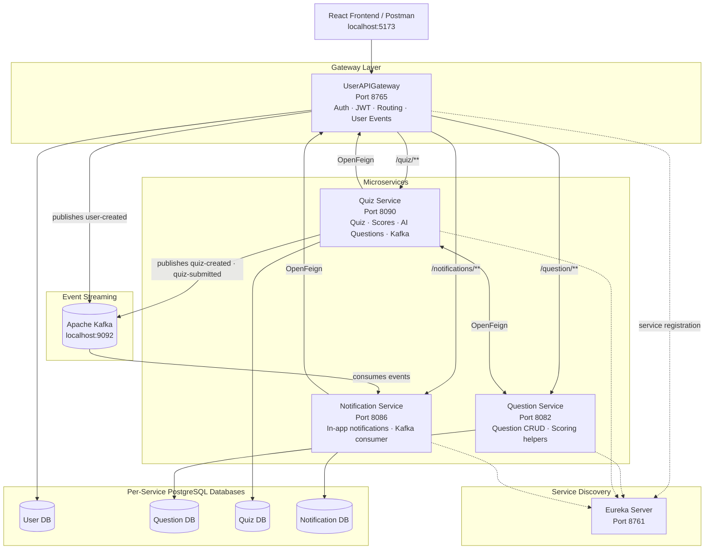
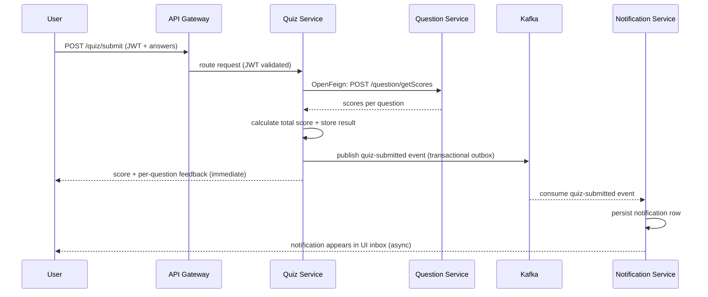

# 🧠 AI-Powered Quiz Platform

> A **production-grade microservices quiz platform** with OpenAI-driven question generation, event-driven
> scoring and notifications via Kafka, and role-based access across 5 independent services.

<p align="left">
  
  
  
  
  
  
  
</p>

---

## ✨ Overview

Most quiz platforms generate static questions from a fixed bank. This platform generates questions
**dynamically using OpenAI** based on category and difficulty level — with graceful fallback to DB-stored
questions if the AI call fails. Scoring and notifications are fully **decoupled via Kafka**, ensuring
quiz submission never blocks on notification delivery.

Two roles drive the platform:
- **Teacher (Admin)** — creates quizzes, assigns them to student batches, manages the question bank,
  approves new student registrations, and monitors sent/failed notifications
- **Student (User)** — takes assigned quizzes, views per-question feedback after submission,
  tracks score history, and receives in-app notifications

```
Teacher creates quiz → assigns to student batch
        │
        ▼  Student submits answers
        ▼  Quiz Service scores via OpenFeign → Question Service
        ▼  Publishes quiz-submitted event to Kafka (transactional outbox)
        ▼
Notification Service consumes event → persists notification → surfaces in student UI inbox
Score returned to student immediately — notification delivery is fully async
```

---

## 🏛️ Architecture



### How a quiz submission is processed



---

## 🚀 Features

**AI & Question Generation**
- 🤖 **OpenAI-driven question generation** — dynamic questions by category and difficulty level
- 🔄 **Graceful fallback** — if OpenAI call fails, falls back to DB-stored questions silently
- 📊 **Difficulty-based generation** — easy, medium, hard question sets per category
- 🔍 **Per-question review** — after submission, users see correct/incorrect per question with feedback

**Event-Driven Architecture**
- 📨 **Kafka transactional outbox** — at-least-once delivery guarantee for all events
- 🔁 **Idempotent consumers** — re-attempt-safe quiz submission and notification processing
- 📬 **Async notifications** — scoring never blocks on notification delivery
- 📋 **3 Kafka topics** — user-created, quiz-created, quiz-submitted events

**Platform & Security**
- 🔐 **JWT auth** — access + refresh tokens with server-side session refresh on role promotion
- 👥 **Role-based access** — Teacher (Admin) / Student (User) with protected frontend routing per role
- 🧭 **Admin approval flow** — students land in UNVERIFIED state; teacher activates them
- 🌐 **API Gateway** — centralized routing, JWT validation, gateway filters
- 🔍 **Eureka service discovery** — all services register and resolve via Eureka
- 🔗 **OpenFeign inter-service calls** — typed HTTP clients between Quiz and Question services

**Quiz Lifecycle**
- ✏️ **Teacher** — creates quizzes, assigns to student batches, manages question bank
- 📝 **Student** — takes assigned quizzes, views per-question feedback after submission
- 📈 Score history and quiz history per student and batch
- 🔔 In-app notification inbox with read/unread state for both roles
- 🗂️ Question bank management with category filtering and pagination

---

## 🧰 Tech Stack

| Layer | Technology |
|---|---|
| Backend | Java 17, Spring Boot, Spring Security |
| API Gateway | Spring Cloud Gateway, JWT filter, gateway filters |
| Service Discovery | Spring Cloud Netflix Eureka |
| Inter-service calls | Spring Cloud OpenFeign |
| Messaging | Apache Kafka (transactional outbox pattern) |
| AI / LLM | Spring AI, OpenAI GPT (question generation) |
| Database | PostgreSQL (per-service isolation — 4 databases) |
| ORM | Spring Data JPA |
| Frontend | React 18, TypeScript, Vite, TailwindCSS, React Query, Axios |
| Testing | JUnit 5, Vitest |

---

## 🧱 Design Highlights

- **Kafka transactional outbox** — quiz submission publishes events atomically with the DB write,
  guaranteeing at-least-once delivery to the Notification Service with no message loss on failure

- **Graceful AI fallback** — if OpenAI question generation fails for any reason, the platform
  silently falls back to DB-stored questions, ensuring quiz availability is never blocked by AI availability

- **Per-service database isolation** — each microservice owns its own PostgreSQL database with zero
  cross-service DB access; all inter-service data needs go through OpenFeign HTTP calls

- **Idempotent quiz submission** — re-attempt-safe submission prevents double-scoring on retries or
  network failures

- **Admin approval flow** — new users land in UNVERIFIED state; on admin promotion, the frontend
  automatically refreshes the session token to reflect the new role without requiring re-login

- **Centralized auth at gateway** — JWT validation happens once at the API Gateway layer; downstream
  services trust the gateway and focus purely on business logic

---

## 📋 Services

| Service | Directory | Port | Purpose |
|---|---|---|---|
| Eureka Server | `EurekaServer-Service-Registry` | `8761` | Service registry and dashboard |
| API Gateway | `UserAPIGateway` | `8765` | Auth, JWT, routing, user management, Kafka publishing |
| Question Service | `MicroserviceQuestionQuizApp` | `8082` | Question CRUD, scoring helpers |
| Quiz Service | `MicroserviceQuizService` | `8090` | Quiz lifecycle, AI generation, Kafka publishing |
| Notification Service | `NotificationService` | `8086` | In-app notifications, Kafka consumer |
| Frontend | `frontend` | `5173` | React TypeScript SPA |

---

## 📡 API Reference

### Authentication

| Method | Endpoint | Description |
|---|---|---|
| `POST` | `/auth/register` | Register — lands in UNVERIFIED state |
| `POST` | `/auth/login` | Login → access + refresh JWT |
| `GET` | `/auth/session` | Refresh session token with latest role |
| `GET` | `/auth/getRoles/{username}` | Get user role |
| `POST` | `/auth/updateRole` | Promote/demote user role (admin) |

Use protected endpoints with:
```
Authorization: Bearer <token>
```

### Questions

| Method | Endpoint | Description |
|---|---|---|
| `GET` | `/question/all` | Paginated question list |
| `GET` | `/question/category/{category}` | Questions by category |
| `POST` | `/question/add` | Add a question |
| `GET` | `/question/generate?category={category}` | Generate random question IDs |
| `POST` | `/question/getQuestions` | Get question wrappers by IDs |
| `POST` | `/question/getScores` | Score submitted answers |

### Quizzes

| Method | Endpoint | Description |
|---|---|---|
| `POST` | `/quiz/generate` | Generate a quiz |
| `GET` | `/quiz/{quizId}` | Get quiz by ID |
| `GET` | `/quiz/{quizId}/review` | Per-question feedback after submission |
| `GET` | `/quiz/history` | Quiz history for current user or batch |
| `POST` | `/quiz/submit` | Submit answers → score + Kafka event |
| `GET` | `/quiz/ai-questions?category={c}&level={l}` | Generate AI questions |
| `POST` | `/quiz/finalize` | Finalize quiz with selected questions |

### Notifications

| Method | Endpoint | Description |
|---|---|---|
| `GET` | `/notifications` | Get current user's notifications |
| `GET` | `/notifications/read/{id}` | Mark as read |
| `GET` | `/notifications/unread/{id}` | Mark as unread |
| `GET` | `/notifications/sent` | Sent notifications (admin) |
| `GET` | `/notifications/failed` | Failed notifications (admin) |

---

## 📨 Kafka Topics

| Topic | Publisher | Consumer | Purpose |
|---|---|---|---|
| `user-created-notifications` | API Gateway | Notification Service | New user registration |
| `quiz-created-notifications` | Quiz Service | Notification Service | Quiz creation |
| `quiz-submitted-notifications` | Quiz Service | Notification Service | Quiz submission + score |

---

## ⚡ Quick Start (Local)

**Prerequisites:** Java 17 · Maven · PostgreSQL · Node.js 20 · Kafka · OpenAI API key

### 1. Databases

```sql
CREATE DATABASE shivam;
CREATE DATABASE questiondb;
CREATE DATABASE quizdb;
CREATE DATABASE notificationdb;
```

### 2. Kafka

Start Zookeeper and Kafka broker on `localhost:9092`. Topics are auto-created on first publish.

### 3. Configuration

Each service has a safe template at `src/main/resources/application.example.properties`. Copy and fill in:

```bash
cp src/main/resources/application.example.properties src/main/resources/application.properties
```

Key variables:

| Variable | Purpose |
|---|---|
| `spring.datasource.username` / `password` | PostgreSQL credentials |
| `jwt.secret` | JWT signing key (≥ 32 chars, Base64) |
| `spring.ai.openai.api-key` | OpenAI API key |
| `spring.kafka.bootstrap-servers` | Kafka broker address |

### 4. Start services in order

```bash
# 1. Service registry
cd EurekaServer-Service-Registry && mvn spring-boot:run

# 2. API Gateway
cd UserAPIGateway && mvn spring-boot:run

# 3. Question Service
cd MicroserviceQuestionQuizApp && mvn spring-boot:run

# 4. Quiz Service
cd MicroserviceQuizService && mvn spring-boot:run

# 5. Notification Service
cd NotificationService && mvn spring-boot:run
```

### 5. Frontend

```bash
cd frontend
npm install && npm run dev     # → http://localhost:5173
```

**Useful URLs**
- Frontend: `http://localhost:5173`
- API Gateway: `http://localhost:8765`
- Eureka dashboard: `http://localhost:8761`

---

## 🔒 Security

- BCrypt password hashing; teacher-gated student activation (UNVERIFIED → USER)
- Stateless JWT — access + refresh tokens with automatic session refresh on role promotion
- RBAC (Teacher/Admin · Student/User) enforced at gateway filter and service level
- All secrets via environment variables / `application.properties` — **never committed** (see `.gitignore`)
- `application.example.properties` committed as safe template — real configs gitignored

> If any API key or secret was committed earlier, revoke and regenerate it — removing it from the
> latest commit does not erase it from Git history.

---

## 📂 Repository Structure

```
Quiz_Microservices_App/
├── EurekaServer-Service-Registry/   Spring Cloud Eureka server
├── UserAPIGateway/                  API Gateway + auth + user management
├── MicroserviceQuestionQuizApp/     Question Service
├── MicroserviceQuizService/         Quiz Service + AI + Kafka publishing
├── NotificationService/             Notification Service + Kafka consumer
├── frontend/                        React 18 + TypeScript SPA
├── docker-compose.yml
└── README.md
```

---

## 🗺️ Future Improvements

- [ ] **Docker Compose** — single command to spin up all 5 services + Kafka + PostgreSQL
- [ ] **Email notifications** — extend Notification Service with SMTP/SendGrid delivery
- [ ] **Leaderboard** — real-time score ranking via WebSocket or SSE
- [ ] **Quiz scheduling** — assign quizzes to batches with a deadline and auto-close
- [ ] **Analytics dashboard** — per-category accuracy, avg scores, difficulty calibration
- [ ] **Kubernetes deployment** — Helm chart replacing Eureka with K8s native service discovery

---

## 👤 Author

**Shivam Jain** — Senior Backend Software Engineer

*Built as a deep dive into microservices architecture, event-driven systems, and AI integration at scale.*
